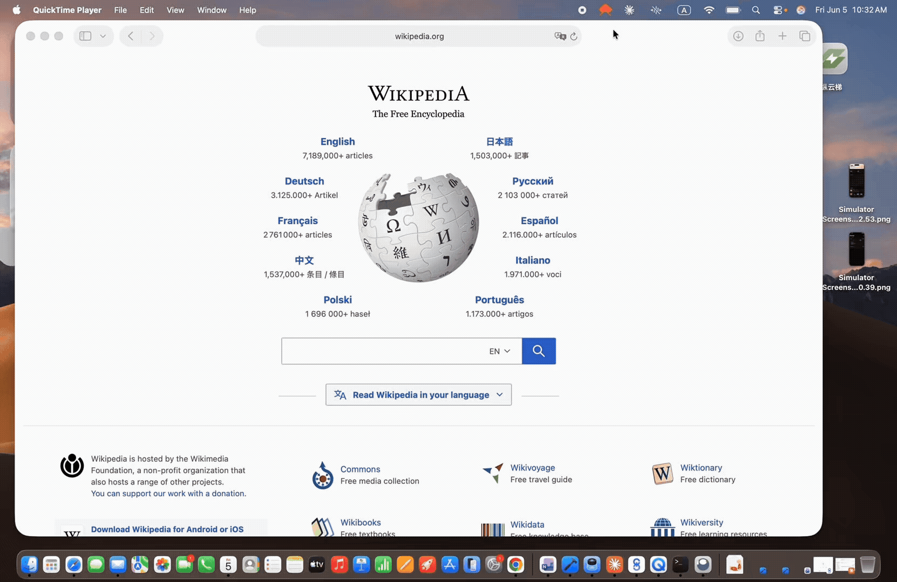

# 🐦 Standup Break

A tiny Mac menu bar app that sends a cute flying toucan across your screen to remind you to stand up and take a break.



---

## Why

It's easy to sit for hours without noticing. Standup Break gives you a playful nudge — no annoying popups, just a toucan flying by.

---

## Features

- 🐦 Cute Lottie toucan animation flies across your screen
- ⏱ Fully customizable reminder interval (5 min → 2 hours)
- 🖥 Appears over all other apps so you actually notice it
- 🔇 Silent — no sounds, no dock icon, no interruptions
- 🍎 Lives quietly in your menu bar

---

## Download

👉 **[Download the latest `.dmg`](../../releases/latest)**

Requires macOS 10.12+ on Apple Silicon (M1/M2/M3/M4).

### Install
1. Open the `.dmg` file
2. Drag **Standup Break** to your Applications folder
3. Open it — if macOS warns about an unidentified developer, go to:
   **System Settings → Privacy & Security → Open Anyway**

---

## Usage

Once running, the app lives in your menu bar as a small 🐦 icon.

**Right-click the icon** to:
- **Show Now** — trigger the animation immediately
- **Settings…** — change how often the bird visits
- **Quit** — stop the app

---

## Built With

- [Electron](https://www.electronjs.org/)
- [Lottie Web](https://github.com/airbnb/lottie-web)
- Toucan animation by [Diogo de Freitas](https://lottiefiles.com) via LottieFiles

---

## Build From Source

```bash
# Clone the repo
git clone https://github.com/susantontr/standup-break.git
cd standup-break

# Install dependencies
npm install

# Run in development
npm start

# Build the .dmg
npm run dist
```

---

## Contributing

Got ideas? Found a bug? PRs and issues are welcome! 🙌

---

## License

MIT
